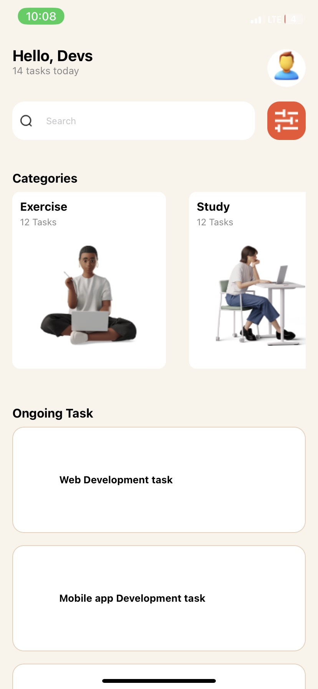

# DCIT 202 Assignment 3

**Student ID: 11286009**

## My-App

### Installation

1. Clone the repository to your local machine.

### Usage

Once the application is running, you can take advantage of the following features:

#### Header

- Displays a greeting message.
- Shows the number of tasks for the day.
- Includes a profile picture of the user.

#### Search Bar

- Allows users to search for tasks.

#### Categories

- Displays tasks grouped into categories such as Exercise, Study, Meeting, etc.

#### Ongoing Tasks

- Lists all ongoing tasks the user is performing or yet to.

### Components

The application is structured into various components to enhance modularity:

#### Header

- **File**: `Header.js`
- **Function**: Displays the header section with a greeting and profile picture.

#### SearchBar

- **File**: `SearchBar.js`
- **Function**: Contains the search input and filter icon.

#### App

- **File**: `App.js`
- **Function**: The main component that integrates all other components.

### Styling

- The app utilizes `StyleSheet` for component styling.
- Styles are defined within each component file to maintain modularity.

## Screenshot of my-app

